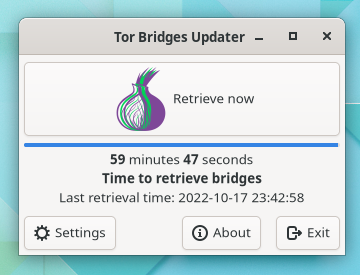

# Tor Bridges Updater

### Update your Tor bridges on a schedule



**Tor Bridges Updater** helps you to retrieve Tor [bridges](https://tb-manual.torproject.org/bridges/), and reminds you to retrieve them. Updating your bridges in time helps you circumvent censorship, as older bridges can get blocked.

It can also add new bridges to your `torrc` file. If you don't have access to `bridges.torproject.org`, you can specify a proxy for connection.

This utility was **not** made by Tor Project:

>This product is produced independently from the Tor® anonymity software and carries no guarantee from The Tor Project about quality, suitability or anything else.

## Get the utility

**Tor Bridges Updater** is available on Windows, macOS and Linux.

[Get the latest release](https://gitlab.com/yakovlevegor/TorBridgesUpdater/-/releases)

**To install** on Windows and Linux, unpack the application's folder and run the install* script. On macOS just copy the .app to preferable directory, and run it from there.

## Building

To build **Tor Bridges Updater**, you first need to setup your environment.

[See what to install](BUILD-PREPARE.md)

After everything has been set up, enter the project's directory, and run

`cargo build -r`

Your binary will be in `target/release/`

If you want to distribute the project, **Windows** and **macOS** binaries must be **bundled** with **Gtk**. To receive notifications on **Linux**, you will also need to deploy/install the project with a script.

Read [Deployment Guide](DEPLOY.md) for a how-to.

## Translating

If you want to translate the project, please refer to [Translating Guide](TRANSLATING.md)

## License

#### The Unlicense

```
This is free and unencumbered software released into the public domain.

Anyone is free to copy, modify, publish, use, compile, sell, or
distribute this software, either in source code form or as a compiled
binary, for any purpose, commercial or non-commercial, and by any
means.

In jurisdictions that recognize copyright laws, the author or authors
of this software dedicate any and all copyright interest in the
software to the public domain. We make this dedication for the benefit
of the public at large and to the detriment of our heirs and
successors. We intend this dedication to be an overt act of
relinquishment in perpetuity of all present and future rights to this
software under copyright law.

THE SOFTWARE IS PROVIDED "AS IS", WITHOUT WARRANTY OF ANY KIND,
EXPRESS OR IMPLIED, INCLUDING BUT NOT LIMITED TO THE WARRANTIES OF
MERCHANTABILITY, FITNESS FOR A PARTICULAR PURPOSE AND NONINFRINGEMENT.
IN NO EVENT SHALL THE AUTHORS BE LIABLE FOR ANY CLAIM, DAMAGES OR
OTHER LIABILITY, WHETHER IN AN ACTION OF CONTRACT, TORT OR OTHERWISE,
ARISING FROM, OUT OF OR IN CONNECTION WITH THE SOFTWARE OR THE USE OR
OTHER DEALINGS IN THE SOFTWARE.

For more information, please refer to <https://unlicense.org/>
```
